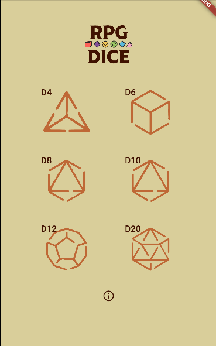
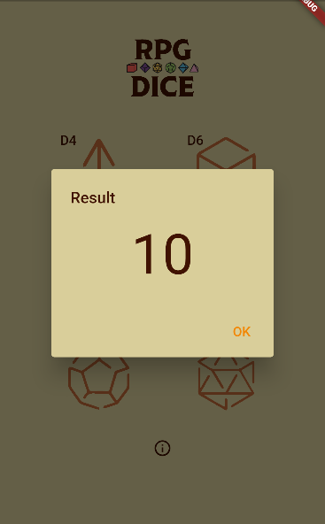

# RPG Dice Flutter

This project consists of RPG dice that generate random numbers.

In these images we see the flow of the screens

<div style="display: flex;">
&nbsp;&nbsp;

</div>

## How to get its code

This project was developed using:
- Flutter
- Dart
- Visual Studio Code
- Flutter Public Package:
    - Mobx
    - Lottie
    - Build Runner
    - Mobx Codegen

To download this project and make changes, you can use the script bellow:

```
git clone https://github.com/EmmanuelPereira1/dice_rpg_flutter_project.git
```